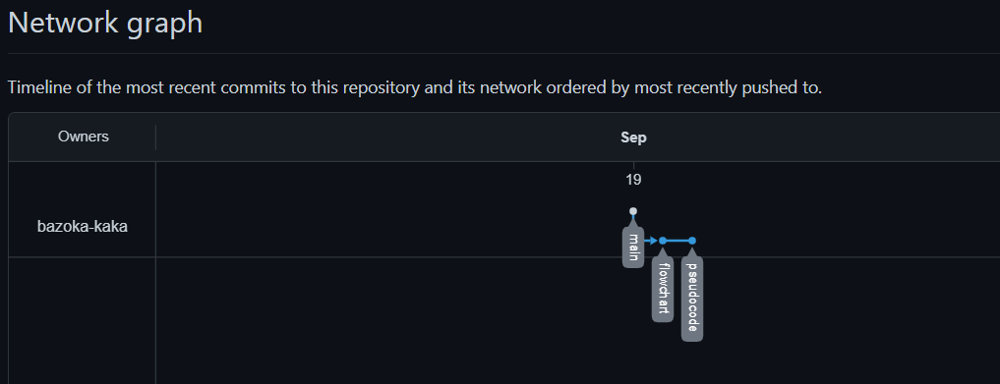

# Kasir Hezkimart

Oleh: Yehezkiel Wiradhika
<br>
ID: BE2602744

## Alasan Pemilihan Aplikasi

- Dibutuhkan dalam toko Hezkimart sebagai program komputer yang dapat mendata dan menghitung jumlah barang yang terjual beserta penghasilan yang didapatkan dari penjualan tersebut.

## Tools yang Digunakan

1. Website [app.diagrams.net](https://app.diagrams.net/) untuk membuat flowchart
2. [Visual Studio Code](https://code.visualstudio.com/) untuk membuat pseudocode

## Hasil Pengerjaan Pseudocode dan Flowchart

1. [Flowchart](https://github.com/bazoka-kaka/yehezkiel_wiradhika-kasir_hezkimart/pull/1)
2. [Pseudocode](https://github.com/bazoka-kaka/yehezkiel_wiradhika-kasir_hezkimart/pull/2)

## Alur Pembuatan

Langkah-langkah pembuatan:

1. Membuat flowchart
2. Membuat pseudocode
3. Buat README
4. commit dan push ke github

## Commit Message yang Dibuat

1. README
   <br>

   ```
   add README
   ```

2. Flowchart
   <br>

   ```
   add flowchart
   ```

3. Pseudocode
   <br>

   ```
   add pseudocode
   ```

## Alur dari flow pada Repository Melalui Git History/Network


